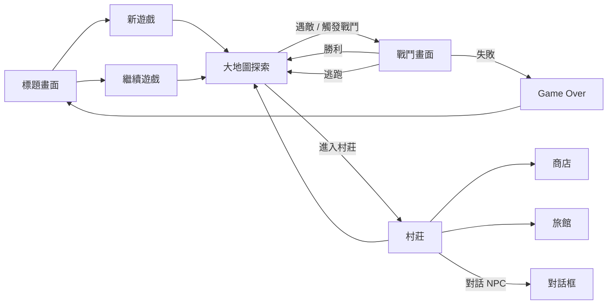

# 設計 Design

## 1. 技術選型

| 層 | 選擇 | 理由 |
|---|---|---|
| 建置工具 | **Vite** | 啟動快、HMR 順、TypeScript 開箱即用 |
| 語言 | **TypeScript** | 型別安全、IDE 友好、便於後期擴充 |
| UI 框架 | **React 18** | 大量選單 / 對話 / 戰鬥 UI，React 處理狀態渲染最熟悉 |
| 狀態管理 | **Zustand** | 比 Redux 輕量、API 簡潔，足以管理整個遊戲狀態 |
| 路由 | **React Router** | 標題 / 遊戲 / 設定 三層分明 |
| 地圖渲染 | **CSS Grid + DOM** | MVP 不用 Canvas，DOM tile 已足夠；後期若效能不夠再換 PixiJS |
| 戰鬥動畫 | **CSS Transitions + Framer Motion** | 立繪縮放 / 抖動 / 飛行傷害數字，DOM 動畫已綽綽有餘 |
| 音效 | **HTML5 Audio API** | 原生即可 |
| 儲存 | **LocalStorage**（MVP）+ **匯出 JSON**（備援） | 詳見 §4 |
| 部署 | **GitHub Pages** 或 **Vercel** | 純靜態，免運維成本 |

## 2. 場景流程



## 3. 模組架構

```
src/
├── core/              # 引擎核心
│   ├── store.ts       # Zustand 全域 store（玩家狀態、隊伍、進度旗標）
│   ├── save.ts        # LocalStorage 序列化、匯出/匯入 JSON
│   ├── events.ts      # 場景間事件匯流排
│   └── rng.ts         # 可種子化隨機數（除錯用）
├── data/              # 靜態遊戲資料（JSON，可手改）
│   ├── monsters.json
│   ├── items.json
│   ├── skills.json
│   ├── maps/
│   └── dialogues/
├── scenes/            # 場景元件
│   ├── Title.tsx
│   ├── Overworld.tsx
│   ├── Battle.tsx
│   ├── Village.tsx
│   ├── Shop.tsx
│   └── GameOver.tsx
├── systems/           # 遊戲系統
│   ├── battle.ts      # 回合制戰鬥引擎
│   ├── encounter.ts   # 隨機遇敵
│   ├── inventory.ts   # 道具 / 裝備
│   ├── leveling.ts    # 經驗值與升等
│   └── dialogue.ts    # 對話樹解析
├── ui/                # 可重用 UI 元件
│   ├── HpBar.tsx
│   ├── DialogueBox.tsx
│   ├── MenuButton.tsx
│   └── DamageNumber.tsx
├── assets/            # 立繪、tile、BGM、SE
└── App.tsx
```

## 4. 關鍵設計決策

### 4.1 存檔策略

- **主要儲存**：LocalStorage（key = `browser-rpg.save.v1`）
- **資料格式**：JSON 字串 < 1MB（避開 LocalStorage 上限）
- **自動存檔**：每場戰鬥結束後 + 進入新場景時
- **手動存檔**：村莊存檔點、隨時可手動匯出 JSON 檔案下載到本機
- **匯入**：從本機 JSON 檔案讀回 store
- **跨裝置**：透過匯出/匯入手動同步（無雲端）

### 4.2 戰鬥系統（回合制）

```
turn = 1
while 雙方都有人活著:
    根據速度排序角色 → 行動順序
    for actor in 行動順序:
        if actor 是玩家:
            等待玩家選擇行動（攻擊/魔法/道具/防禦/逃跑）
        else:
            AI 選擇行動（簡單規則：HP < 30% 用補品、否則攻擊最低 HP）
        執行行動 → 結算傷害/效果 → 動畫
        檢查雙方存活
    turn += 1

if 玩家勝 → 經驗 + 金幣 + 道具掉落 → 回到 overworld
elif 玩家敗 → GameOver
elif 逃跑成功 → 回到 overworld
```

### 4.3 遊戲資料皆 data-driven

怪物、道具、技能、地圖、對話全部存 JSON。修改數值不必改 code，只動 JSON 即可平衡。這也讓「擴充內容」成本極低。

### 4.4 多分頁防護

進入遊戲時寫入 `sessionLock`（時間戳 + tab ID）到 LocalStorage；其他分頁進來時偵測到 lock 就提示「另一個分頁正在遊玩，是否搶佔？」

## 5. MVP 範圈（確認）

| 項目 | MVP 內容 |
|---|---|
| **職業** | 1 個（戰士，平衡好調） |
| **怪物** | 5 種（史萊姆、哥布林、骷髅、巨蜘蛛、頭目） |
| **地圖** | 1 個小村莊 + 1 個小迷宮（10×10 ~ 15×15 tile） |
| **道具** | 5 種（補血藥、補魔藥、解毒劑、武器、防具） |
| **技能** | 3 種（普攻、火球、治癒） |
| **劇情** | 開場 + 村莊任務 + 迷宮頭目 + 結尾，總長度 15–30 分鐘可破關 |
| **題材** | **奇幻劑與魔法**（預設，AI 素材最好找） |

## 6. 確認事項

- 題材：**奇幻劑與魔法**
- 存檔：**LocalStorage + 匯出 JSON**
- MVP 範圈：上表
- 部署：待定（GitHub Pages / Vercel / 不部署）
